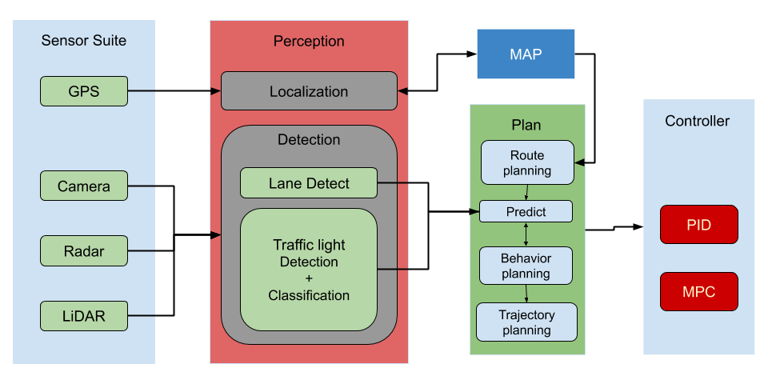

# CarND Capstone
## Introduction
This document provides the introduction, details and results of the final project for the Udacity Self-Driving Car Engineer Nanodegree. As part of this project completion, a solo effort was performed that resulted in updating existing nodes from Udacity and also creation of new nodes to implement core functionality of an autonomous vehicle. More information about this project can be obtained from the project introduction here.

## Team

This project was completed individually by Prasanna Kolar

## Setup Instructions

The system comprises of usage of any of the 3 systems Udacity provided workspace, Native(local) installation, Docker Installation

### Workspace
The system is provided by Udacity with an online simulation environment.  This system was developed using unity and is used in initial tests.  However due to the situation created by the Covid-19 health crisis this is the only system used.

### Native Installation
* Follow these instructions to install ROS
  * [ROS Kinetic](http://wiki.ros.org/kinetic/Installation/Ubuntu) if you have Ubuntu 16.04.
  * [ROS Indigo](http://wiki.ros.org/indigo/Installation/Ubuntu) if you have Ubuntu 14.04.
* [Dataspeed DBW](https://bitbucket.org/DataspeedInc/dbw_mkz_ros)
  * Use this option to install the SDK on a workstation that already has ROS installed: [One Line SDK Install (binary)](https://bitbucket.org/DataspeedInc/dbw_mkz_ros/src/81e63fcc335d7b64139d7482017d6a97b405e250/ROS_SETUP.md?fileviewer=file-view-default)
* Download the [Udacity Simulator](https://github.com/udacity/CarND-Capstone/releases).
The computer was a dual hexcore processor system with 128 GB of RAM and ample diskspace and a GPU- 1070ti.  This is a beefy system used in previous ML projects/  However, there were technical issues installing the development environment on this computer
### Docker Installation
The same computer was tried for Docker usage.  This is a beefy system used in previous ML projects/  However, there were technical issues installing Docker and configuring it accurately.
[Install Docker](https://docs.docker.com/engine/installation/)

Build the docker container
```bash
docker build . -t capstone
```
Run the docker file
```bash
docker run -p 4567:4567 -v $PWD:/capstone -v /tmp/log:/root/.ros/ --rm -it capstone
```
#### Port Forwarding
To set up port forwarding, please refer to the [instructions from term 2](https://classroom.udacity.com/nanodegrees/nd013/parts/40f38239-66b6-46ec-ae68-03afd8a601c8/modules/0949fca6-b379-42af-a919-ee50aa304e6a/lessons/f758c44c-5e40-4e01-93b5-1a82aa4e044f/concepts/16cf4a78-4fc7-49e1-8621-3450ca938b77)

## Project Overview
This project can be implemented in a simulator or on the smart vehicle.  Due to Covid restrictions, we implement it in the simulator.

## Architecture 

### CARLA Architecture
Carla is a custom Lincoln MKZ that Udacity modified into a self-driving car. The self-driving system can be broken down into four major sub-systems: Sensor suite, Perception, Planning and finally the Control sub system.



### ROS Architecture


### Simulation

### Sensing and Perception
The sensors 'read' or 'measure' the world or the environment that the autonomous vehicle works in and provides the data to the perception module.  The system in this project has multiple sensors, which may also be termed as a sensor suite.  The sensors are camera, lidar, sonar, GPS and other related odometric sensors.  For the sake of the completion of this project, camera and localiztaion sensors will be used.
The Perception sub-module accepts the data from the sensing sub-module and processes it.  The output is provided to the localization submodule and detection submodules.  Further to this, the processed data is sent to the machine learning modules such as traffic light detection module, the identification and classification modules.  The output of the localization and the perception submodules are also input the controls sub-module.  As part of this project, a Proportional(P) Integral(I) and Diffential(D) - PID controller is implemented, which takes in input from the perception module and sends commands to the Drive By Wire(DBW unit.  The DBW also signals or controls the drive system on the car CARLA either simulated or the real car.  We can term that that the perception sub-module is capable of abstracting the raw data coming from the sensors into localization and traffic light detection functionalities.


### Path planning
The Path Planning component can be broken into  Route, Localization and Trajectory planning sub-components.

#### Route
The route planner decides at a higher level, the paths that the vehicle needs to take.  This path is decided amongst multiple paths between 2 points on a map.  

#### Behavior planning
Route planner doesnt count the undertainties during operation.  This is handled in the behavior planner.  Using sensory input, the behavior planner lets the system know which behavior to choose for the immediate need to handle the uncertainty noted in the sensor systems.
In the project, we restrict this functionality to traffic management;  Red is stop, yellow is caution and green is go.
#### Trajectory 
Based on the input, the trajectory planner decides which trajectory is the best to execute the required behavior as given in the behavior planner.

#### Localization
This components tells the car where it is, in the given map.  The odometric and localization sensors feed into the system which then estimates the transformation between each required measurement and the map.

### Traffic ML system
The machine learning system handles input from the camera(s) in order to feed into a behavior planner.  The planner then gives input to the trajectory planner to choose the best 'sub-route' to mitigate the uncertainty seen at the moment.
#### Traffic light Detector
The traffic light detection system is capable of detecting traffic lights and feed them into the classifier.
#### Traffic light image classifier
The traffic light classifier is able to detect the type of traffic light and then feed into the trajectory planner to temporarily handle the current situation that the car is handling.
### System and Controls
The system and controls unit is the final module which commands the simulated car or the real car.  This component accepts the trajectory and processes it through the PID controller.  This enables a smooth vehicle operation especially when a new behavior is observed.

## Node Development


### Waypoint Loader

### Waypoint Updater


### Traffic light system

#### Traffic light Detector


#### Traffic light image classifier

### Other library/driver information
Outside of `requirements.txt`, here is information on other driver/library versions used in the simulator and Carla:

Specific to these libraries, the simulator grader and Carla use the following:

|        | Simulator | Carla  |
| :-----------: |:-------------:| :-----:|
| Nvidia driver | 384.130 | 384.130 |
| CUDA | 8.0.61 | 8.0.61 |
| cuDNN | 6.0.21 | 6.0.21 |
| TensorRT | N/A | N/A |
| OpenCV | 3.2.0-dev | 2.4.8 |
| OpenMP | N/A | N/A |


## Tests

### Simulation system

### Real-world system 

